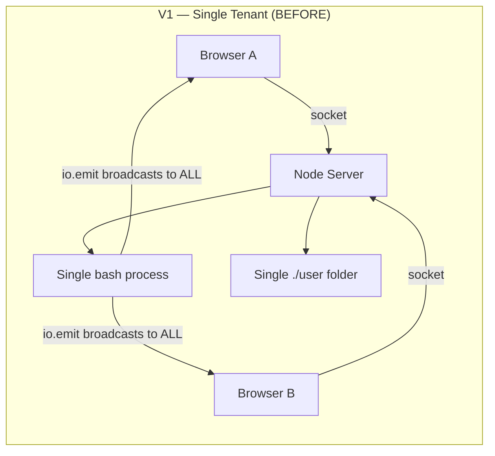
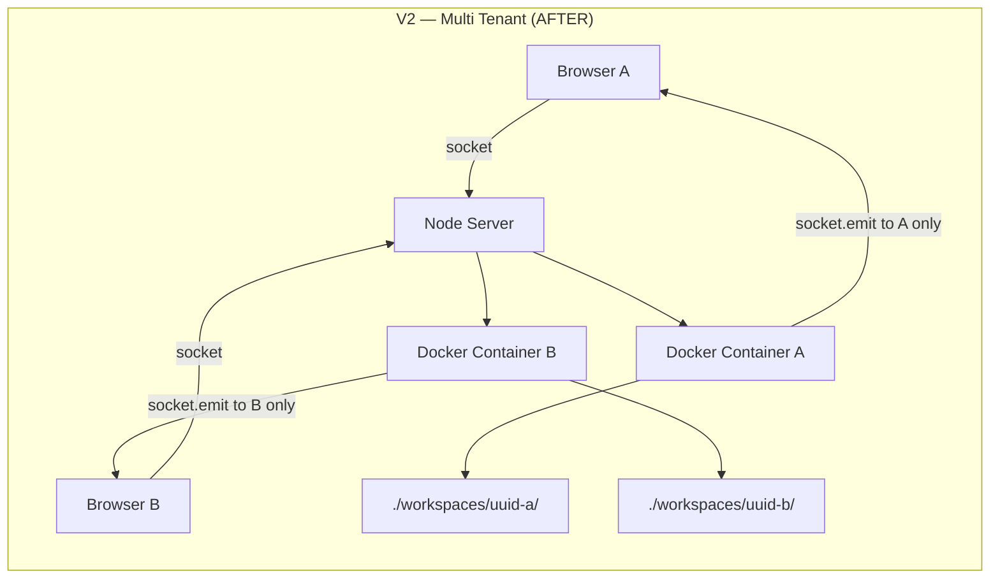

# Cloud IDE: From Single-Tenant to Multi-Tenant Docker Architecture

This document explains exactly what the Cloud IDE looked like **before** (v1 — single-tenant), what problems that had, and how every piece of code was changed to build the **current** version (v2 — multi-tenant with Docker isolation).

---

## The Core Problem with v1

In the original version, the entire IDE shared **one single bash process** and **one single folder** (`./user`) across all connected clients. This created three critical issues:

| Problem | Impact |
|---|---|
| **Shared Terminal** | If User A types `ls`, User B also sees the output. If User A types `rm -rf /`, it runs on the host machine. |
| **Shared File System** | Everyone reads and writes to the same `./user` folder. User A's code overwrites User B's. |
| **No Isolation** | A malicious user could access system files, install malware, or crash the server. |

---

## Architecture Comparison





---

## File-by-File Breakdown

---

### 1. `server/index.js` — The Brain

This is where 90% of the changes happened.

#### BEFORE (v1): Global, shared resources

```javascript
// A single bash process shared by ALL users
const ptyProcess = pty.spawn('bash', [], {
    name: 'xterm-256color',
    cols: 80,
    rows: 30,
    env: process.env,
    cwd: process.env.INIT_CWD + '/user'  // Everyone shares ./user
})

// A single file watcher — broadcasts to ALL connected sockets
chokidar.watch('./user').on('all', (event, path) => {
    io.emit('files:refresh', path)  // io.emit = BROADCAST to everyone
})

// Terminal output goes to EVERYONE
ptyProcess.onData(data => {
    io.emit('terminal:data', data)  // io.emit = BROADCAST to everyone
})

io.on("connection", (socket) => {
    // When User A types, the shared bash process executes it
    socket.on('terminal:write', (data) => {
        ptyProcess.write(data)
    })

    // File saves go to the shared ./user folder
    socket.on('file:change', async ({ content, path }) => {
        await fs.writeFile(`./user/${path}`, content)
    })
})

// API routes read from the shared ./user folder
app.get('/files', async (req, res) => {
    const fileTree = await generateFileTree('./user')
    return res.json({ files: fileTree })
})
```

**What's wrong:**
- `io.emit()` broadcasts to **every** connected socket — so User A sees User B's terminal output
- There is only **one** `ptyProcess` — all users share the same shell session
- There is only **one** `./user` folder — everyone reads/writes the same files
- No resource limits — a user could run `:(){ :|:& };:` (fork bomb) and crash the server

#### AFTER (v2): Per-session isolated resources

```javascript
const { v4: uuidv4 } = require('uuid')

// Store active sessions: sessionId -> { ptyProcess, watcher, workspacePath }
const sessions = new Map()
const WORKSPACES_DIR = path.resolve(__dirname, 'workspaces')

io.on("connection", async (socket) => {
    const sessionId = uuidv4()
    const workspacePath = path.join(WORKSPACES_DIR, sessionId)

    // 1. Create an ISOLATED workspace directory for this user
    await fs.mkdir(workspacePath, { recursive: true })
    await fs.writeFile(
        path.join(workspacePath, 'index.js'),
        '// Welcome to Cloud IDE!\nconsole.log("Hello, World!");\n'
    )

    // 2. Spawn a Docker container JUST for this user
    const ptyProcess = pty.spawn('docker', [
        'run', '-it', '--rm',
        '--name', `ide-${sessionId.slice(0, 8)}`,
        '--memory=128m',     // RAM limit
        '--cpus=0.5',        // CPU limit
        '--network=none',    // No internet (security)
        '-v', `${workspacePath}:/workspace`,
        '-w', '/workspace',
        'cloud-ide-sandbox',
        'bash'
    ], { ... })

    // 3. File watcher scoped to THIS user's workspace
    const watcher = chokidar.watch(workspacePath, { ignoreInitial: true })
    watcher.on('all', () => {
        socket.emit('files:refresh')  // socket.emit = ONLY this user
    })

    // 4. Terminal output goes ONLY to this user
    ptyProcess.onData(data => {
        socket.emit('terminal:data', data)  // socket.emit = ONLY this user
    })

    // 5. Cleanup when user disconnects
    socket.on('disconnect', async () => {
        session.ptyProcess.kill()           // Kills Docker container (--rm auto-removes)
        await session.watcher.close()       // Stop watching files
        await fs.rm(workspacePath, { recursive: true, force: true })  // Delete workspace
        sessions.delete(sessionId)
    })
})
```

**Key differences:**

| Aspect | v1 (Before) | v2 (After) |
|---|---|---|
| Terminal process | Single global `bash` | Per-user Docker container |
| Workspace folder | Shared `./user` | Isolated `./workspaces/<uuid>/` |
| Socket emission | `io.emit()` (broadcast) | `socket.emit()` (unicast) |
| Resource limits | None | 128MB RAM, 0.5 CPU per container |
| Network access | Full host access | `--network=none` (blocked) |
| Cleanup | None | Auto-delete container + folder on disconnect |

---

### 2. `client/src/App.jsx` — Session-Aware Frontend

#### BEFORE (v1): Assumed a single global session

```javascript
// Immediately fetched files from a hardcoded endpoint
const getFileTree = async () => {
    const response = await fetch("http://localhost:9000/files")
    // ...
}

// Immediately fetched file content without session context
const getFileContents = useCallback(async () => {
    const response = await fetch(`http://localhost:9000/files/content?path=${selectedFile}`)
    // ...
}, [selectedFile])
```

**What's wrong:** There's no concept of "which user am I?" — the API just returns whatever is in `./user`, which is the same for everyone.

#### AFTER (v2): Waits for session, passes sessionId in all API calls

```javascript
const [sessionId, setSessionId] = useState(null)

// Wait for the server to assign a session after Docker container is ready
useEffect(() => {
    socket.on('session:init', ({ sessionId: sid }) => {
        setSessionId(sid)
    })
    return () => socket.off('session:init')
}, [])

// Pass sessionId in every API call so the server knows which workspace to read
const getFileTree = useCallback(async () => {
    if (!sessionId) return
    const response = await fetch(`http://localhost:9000/files?sessionId=${sessionId}`)
    // ...
}, [sessionId])

const getFileContents = useCallback(async () => {
    if (!selectedFile || !sessionId) return;
    const response = await fetch(
        `http://localhost:9000/files/content?sessionId=${sessionId}&path=${selectedFile}`
    )
    // ...
}, [selectedFile, sessionId])

// Show loading screen while Docker container is spinning up
if (!sessionId) {
    return <p>⚡ Spinning up your environment...</p>
}
```

**Key differences:**

| Aspect | v1 (Before) | v2 (After) |
|---|---|---|
| Session awareness | None | Receives `sessionId` from server |
| API calls | No session context | All calls include `?sessionId=...` |
| Initial state | Immediately renders | Shows loading screen until Docker is ready |
| Header | Just "Cloud IDE" | Shows `Session: abc123ef` badge |

---

### 3. `server/Dockerfile.sandbox` — [NEW] User Container Image

This file didn't exist in v1. It defines the lightweight Ubuntu image that each user's Docker container runs:

```dockerfile
FROM ubuntu:22.04

RUN apt-get update && apt-get install -y --no-install-recommends \
    bash curl git python3 nodejs \
    && rm -rf /var/lib/apt/lists/*

WORKDIR /workspace
CMD ["bash"]
```

Each container runs this image with these security constraints:
- `--memory=128m` — Can't use more than 128MB RAM
- `--cpus=0.5` — Can't use more than half a CPU core
- `--network=none` — No internet access (can't download malware or attack other services)
- `--rm` — Container is automatically deleted when the shell exits

---

### 4. `server/nodemon.json` — [NEW] Fix Infinite Restart Loop

**The Bug:** When a user connects, the server creates `./workspaces/<uuid>/index.js`. Nodemon detects this file change and restarts the server. The restart disconnects the client, which reconnects and creates a new workspace, which triggers another restart → **infinite loop**.

```json
{
  "watch": ["index.js"],
  "ignore": ["workspaces/", "node_modules/"]
}
```

This tells nodemon to **only** watch `index.js` for changes, and completely ignore the `workspaces/` directory.

---

## Security Model Summary

```
┌─────────────────────────────────────────────────┐
│  Host Server (Node.js)                          │
│                                                 │
│  ┌──────────────┐  ┌──────────────┐             │
│  │ Container A  │  │ Container B  │  ...        │
│  │ RAM: 128MB   │  │ RAM: 128MB   │             │
│  │ CPU: 0.5     │  │ CPU: 0.5     │             │
│  │ Net: NONE    │  │ Net: NONE    │             │
│  │              │  │              │             │
│  │ /workspace ──┼──┼→ workspaces/ │             │
│  │   (mounted)  │  │   uuid-b/   │             │
│  └──────────────┘  └──────────────┘             │
│                                                 │
│  Each container can ONLY see its own /workspace │
│  Each container has NO network access           │
│  Each container is auto-deleted on disconnect   │
└─────────────────────────────────────────────────┘
```

---

## How to Test Isolation

1. Start the server: `npm run dev` (in `server/`)
2. Start the client: `npm run dev` (in `client/`)
3. Open **two browser tabs** to `http://localhost:5173`
4. Each tab should show a **different** session ID in the header
5. Create a file in Tab A's terminal: `echo "hello" > test.txt`
6. Verify Tab B does **NOT** see `test.txt` in its file tree
7. Close Tab A — its container and workspace are deleted automatically
